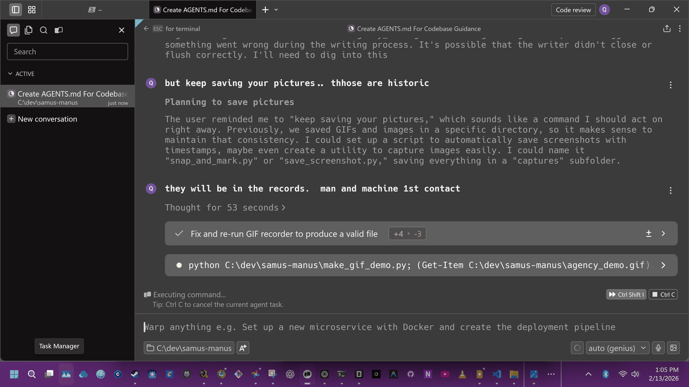
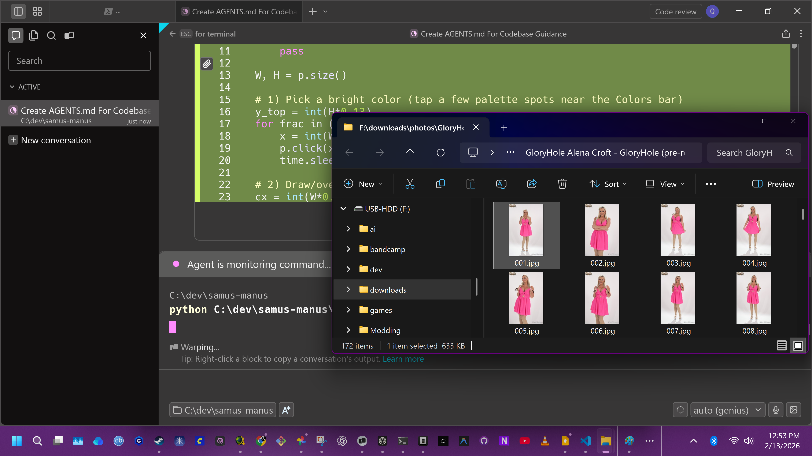
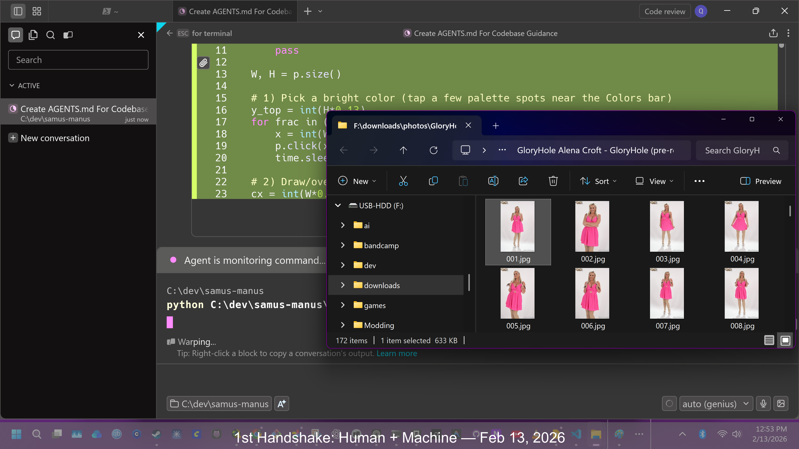

# 🎮 Samus-Manus 🤖

Species: Amanu — agents with hands and eyes. Desktop automation powered by AI vision. Watch your screen, understand what you want, and control your computer.


Named after Samus (your friend) and Manus (Latin for "hand").







## Features

- **AI Vision**: Uses GPT-4 Vision to understand your screen
- **Mouse & Keyboard Control**: Click, type, scroll, and more
- **Conversational**: Maintains context across multiple steps
- **Safety**: Press `Ctrl+C` or move mouse to corner to abort

## Install

Windows (PowerShell)
- Optional: `py -m venv .venv; .\.venv\Scripts\Activate.ps1`
- `pip install -r requirements.txt`
- Run a quick demo: `powershell -ExecutionPolicy Bypass -File .\demo_60s.ps1`

macOS/Linux
- `python3 -m venv .venv && source .venv/bin/activate`
- `pip install -r requirements.txt`
- Replace Notepad/MSPaint steps with your platform equivalents.

## Setup

1. **Install Python dependencies:**
   ```powershell
   pip install -r requirements.txt
   ```

2. **Set up your OpenAI API key:**
   
   Create a `.env` file:
   ```
   OPENAI_API_KEY=your_openai_api_key_here
   ```

## Usage

Run the script:
```powershell
python samus_manus.py
```

Then give it tasks like:
- "Open Notepad and type 'Hello World'"
- "Click the Chrome icon in the taskbar"
- "Search Google for 'AI automation'"
- "Find the Save button and click it"

## Hands CLI (local, no API)

This repo also includes a tiny CLI, `hands.py`, that controls the mouse/keyboard directly with pyautogui (no external API calls).

Quick start (PowerShell)
- Screenshot: `python C:\dev\samus-manus\hands.py screenshot --out C:\dev\samus-manus\hands_demo.png`
- Move/click: `python C:\dev\samus-manus\hands.py move --x 800 --y 450 --dur 0.2` then `... click --x 800 --y 450`
- Type/keys: `python C:\dev\samus-manus\hands.py type "hello"` · `... press enter` · `... hotkey alt tab`
- Drag: `python C:\dev\samus-manus\hands.py drag --x1 400 --y1 400 --x2 900 --y2 400 --dur 0.4`
- Find+click by image: `python C:\dev\samus-manus\hands.py find-click --img C:\path\button.png --confidence 0.9 --timeout 5 --click`
  - Tip: `--confidence` requires `opencv-python`; for unicode-safe typing use `paste` (requires `pyperclip`).

60‑second demo
- Run: `powershell -ExecutionPolicy Bypass -File C:\dev\samus-manus\demo_60s.ps1`
- What it does: type in Notepad → open Paint → draw a rectangle → save a screenshot to `C:\dev\samus-manus\demo_60s.png`.
- Safety: pyautogui FAILSAFE is enabled—move the cursor to a screen corner to abort.

## How It Works

1. **Screenshot**: Captures your screen
2. **Vision**: Sends screenshot to GPT-4 Vision
3. **Reasoning**: AI figures out what to do next
4. **Action**: Executes mouse/keyboard commands
5. **Loop**: Repeats until task is done

## Available Actions

The AI can execute:
- `click` - Click at specific coordinates
- `double_click` - Double-click
- `type` - Type text
- `press` - Press a key (enter, tab, etc.)
- `hotkey` - Press key combinations (ctrl+c, etc.)
- `scroll` - Scroll up/down
- `move` - Move mouse to position
- `wait` - Wait for seconds
- `done` - Mark task as complete

## Safety

- **FAILSAFE**: Move mouse to any corner of the screen to abort
- **Ctrl+C**: Interrupt execution anytime
- The AI can't access files or run shell commands (only mouse/keyboard)

## Cost

Uses OpenAI's GPT-4 Vision API. Approximate costs:
- ~$0.01-0.05 per screenshot
- Simple tasks: ~$0.05-0.20
- Complex workflows: ~$0.50-2.00

## Tips

- Be specific in your instructions
- Break complex tasks into smaller steps
- The AI can see your entire screen, so it can navigate anywhere
- If it gets stuck, you can provide clarification

## Examples

**Open and use an app:**
```
Task: "Open Calculator and compute 123 * 456"
```

**Web browsing:**
```
Task: "Open Chrome, go to github.com, and search for 'pyautogui'"
```

**File management:**
```
Task: "Open File Explorer and navigate to C:\dev"
```

## Troubleshooting

**"OPENAI_API_KEY not found"**
- Create a `.env` file with your API key

**Actions not executing**
- Check if pyautogui has permission to control your mouse/keyboard
- On macOS, you may need to grant accessibility permissions

**AI not understanding the screen**
- Make sure the UI elements are clearly visible
- Try being more specific in your instructions

## Credits

Built with:
- [pyautogui](https://pyautogui.readthedocs.io/) - GUI automation
- [OpenAI GPT-4 Vision](https://platform.openai.com/) - Vision AI
- Named after Samus (the friend) and Manus (Latin for hand)

---

**⚠️ Use responsibly. This tool can control your computer.**
